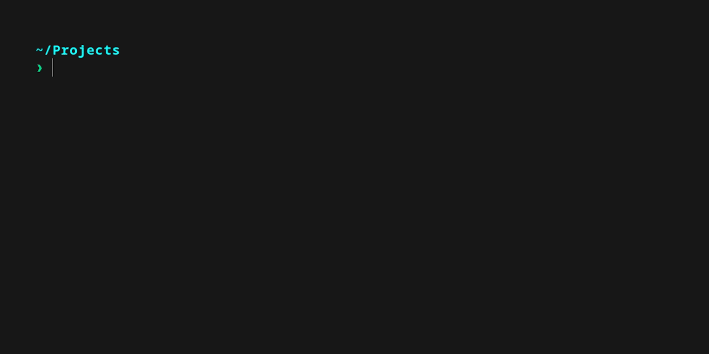

# dotfiles

<p align="center">
  
</p>

<h1></h1>

> Streamlining modern development

## Installation

> [!CAUTION]
> Exercise caution when executing unaudited scripts.
> The provided dotfiles may include configurations that might not be suitable for certain environments.
> Review all files before use and install only the required components.

Clone the repository, execute the installation script from the project root and dotfiles will be symlinked to their appropriate location, overriding the previous.

```sh
git clone --recurse-submodules https://github.com/josugoar/dotfiles.git
cd dotfiles
./install.sh
```
